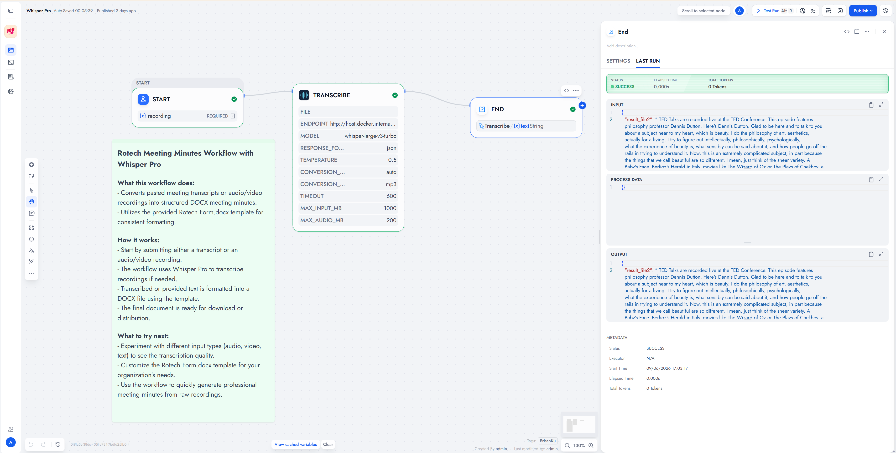

# Whisper Pro

Transcribe audio or video from a Dify file or a direct media URL. Bundled FFmpeg converts when needed. Inference runs on your Whisper-compatible endpoint, not inside this plugin.

**Source:** [https://github.com/erbanku/whisper-pro](https://github.com/erbanku/whisper-pro)

**Contact:** [GitHub issues](https://github.com/erbanku/whisper-pro/issues)

## Overview

Add **Transcribe Audio or Video**, bind one file or one URL, and keep the default local endpoint or point it at your server. Outputs are transcript text plus structured JSON. Linux amd64 / x86_64, Python 3.12.

## Setup

1. Install **Whisper Pro** from the Dify Plugin Marketplace (or from this repository's package).
2. Leave the optional provider **API key** empty unless your endpoint needs a Bearer token.
3. Add **Whisper Pro → Transcribe Audio or Video** to a Chatflow, Workflow, or Agent.
4. Bind a Dify file to **Audio / Video File**, or set **Media URL**. Do not fill both.
5. Confirm the endpoint is reachable from the plugin runtime. Default: `http://host.docker.internal:9997/v1/audio/transcriptions`.

### Use the tool

- **Chatflow / Workflow:** connect `text` or `transcript` to an Answer node. Use JSON for segments, words, language, and duration when the server returns them.
- **Agent:** add the tool and pass one file or one download URL.

`host.docker.internal` must resolve **inside the plugin container**. On Linux Docker, map a host gateway or set an internal service URL.

## Screenshots



## Defaults

|     Setting     |                          Default                           |
| :-------------: | :--------------------------------------------------------: |
|    Endpoint     | `http://host.docker.internal:9997/v1/audio/transcriptions` |
|      Model      |                  `whisper-large-v3-turbo`                  |
| Response format |                           `json`                           |
|   Temperature   |                           `0.5`                            |
| Authentication  |               None (optional Bearer API key)               |
|   Conversion    |            Auto (MP3 when conversion is needed)            |

<details>
<summary>Usage details</summary>

**Auto:** pass `.mp3`, `.wav`, `.m4a`, `.flac` through. Convert other audio and video with bundled FFmpeg.

**Always convert:** decode everything. Use when the name looks supported but the codec is not.

**Never convert:** send original bytes, subject to the submitted-file size limit.

MP3 output: mono, 16 kHz, 64 kbps. WAV output: mono, 16 kHz, 16-bit PCM. First audio track only. A webpage URL is not a media URL.

JSON shape:

```json
{
    "text": "Meeting transcript...",
    "model": "whisper-large-v3-turbo",
    "response_format": "json",
    "language": null,
    "duration": null,
    "segments": [],
    "words": [],
    "source": { "filename": "meeting.mov", "size": 12000000 },
    "audio": { "filename": "meeting.mp3", "size": 800000, "converted": true }
}
```

Choose `verbose_json` if your server supports richer timestamps. Missing fields stay null or empty.

</details>

<details>
<summary>Limits and security</summary>

|           Setting            |   Default   |       Range        |
| :--------------------------: | :---------: | :----------------: |
|      Maximum Input Size      |   1000 MB   |    1 to 2048 MB    |
| Maximum Submitted Audio Size |   200 MB    |    1 to 1024 MB    |
|           Timeout            | 600 seconds | 10 to 3600 seconds |

Sizes are decimal MB. Downloads stream to disk. No automatic retries. Use HTTPS when traffic leaves a trusted network. Certificate validation stays on. Use trusted media URLs. The runtime may reach internal hosts.

See [PRIVACY.md](./PRIVACY.md) and [THIRD_PARTY_NOTICES.md](./THIRD_PARTY_NOTICES.md).

</details>

<details>
<summary>References</summary>

Independent Whisper-compatible integration. Not an official OpenAI or Xinference plugin. FFmpeg is bundled via `imageio-ffmpeg` (Linux x86_64).

</details>
